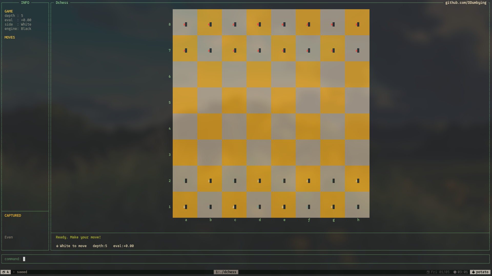

# Dchess - A terminal chess engine written in C.

<p align="center">
  
</p>

It's one of these nerdy thigns that was in my mind for doing it to understand things like `C`, and how really Chess work Technically.

## What it has

**Engine**
- Bitboard-based board representation
- Full move generation (pawns, castling, en passant, promotion)
- Alpha-beta search with minimax
- Static evaluation

**TUI**
- Terminal UI via ncurses (Unicode pieces, color board)
- Custom color palette — parchment/walnut squares, dark canvas background
- Check detection highlighted on the board (red square, gold king)
- Last-move highlighting (green tint on from/to squares)
- Move history, captured pieces, material advantage in the side panel
- Engine plays one side, human the other (configurable)

## Controls

```
e2e4        make a move
go          let engine play
new         reset the game
flip        swap which side engine plays
depth N     set search depth (default 5)
quit        exit
```

## Build

```bash
make
./dchess
```

Requires `ncursesw`.

## Scope
This Engine isn't design to be perfect, it's actually one of these things that built out of passion and because it's something **COOL** to have Chess Engine ctually.

So he should be limited some how, but not having these things (till now) :

- No Networking.
- No GUI for current plans.
- ~**Could** have it's own desing.~
- F Windows.
- IDK what else but we will see..
