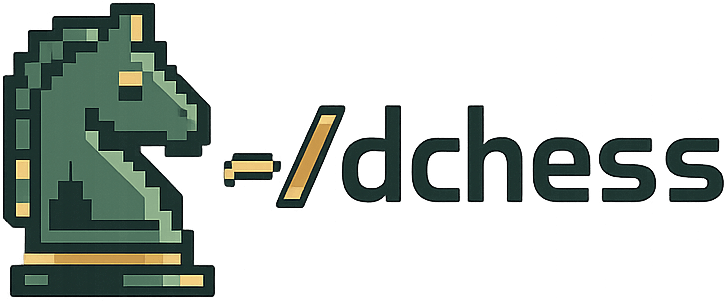

# Dchess - DumbChess


**A terminal chess engine written in C.**
It's one of these nerdy things that was in my mind for doing it to understand things like `C`, and how really Chess work Technically.

**Links:** [GitHub](https://github.com/ddumbying/) · [Documentation](https://ddumbying.vercel.app/projects/dchess/) </br></br>

## Overview

<p align="center">
  
</p>

## What it has

**Engine**
- Bitboard-based board representation
- Full move generation (pawns, castling, en passant, promotion)
- Alpha-beta search with minimax
- Static evaluation

**TUI**
- ncurses interface with Unicode chess pieces (♙♘♗♖♕♔ / ♟♞♝♜♛♚)
- Board scales to fill available terminal size
- Custom 256-color palette — warm parchment/walnut squares, dark charcoal canvas
- Arrow keys or `hjkl` to move cursor, Enter to select and move
- Legal move highlighting — blue squares show valid destinations, bullet on empty squares
- Selected piece highlighted in green
- Check highlighted on the board (red square, gold king)
- Last-move tint on from/to squares
- Move history, captured pieces, material advantage in the side panel
- Engine plays one side, human the other (configurable)

## Controls

**Cursor mode (arrow keys or vim keys)**
```
h / ←       move cursor left
l / →       move cursor right
k / ↑       move cursor up
j / ↓       move cursor down
Enter       select piece / confirm move
Esc         deselect
```

**Command mode (type in the command bar)**
```
e2e4        make a move directly
go          let engine play current side
new         reset the game
flip        swap which side the engine plays
depth N     set search depth (default 5)
eval        show current position evaluation
help        list commands
quit        exit
```

## Build

```bash
make
./dchess
```

Requires `ncursesw`.

## Scope

This Engine isn't designed to be perfect, it's actually one of these things that built out of passion and because it's something **COOL** to have a Chess Engine actually.

So it should be limited somehow, but not having these things (till now):
- No Networking.
- No GUI for current plans.
- ~**Could** have its own design.~
- F Windows.
- IDK what else but we will see..
