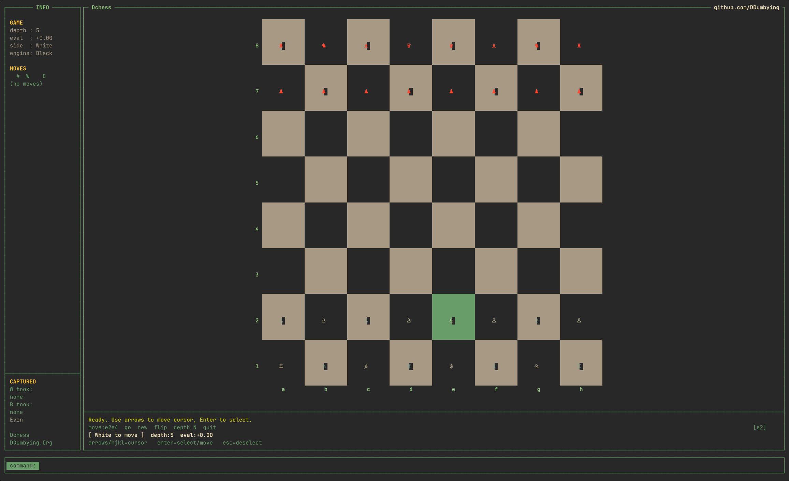

# Dchess - DumbChess


**A terminal chess engine written in C.**

One of these nerdy things built out of passion — to actually understand how `C` works and how chess works technically, under the hood.

**Links:** [GitHub](https://github.com/ddumbying/) · ~[Documentation](https://ddumbying.vercel.app/projects/dchess/)~ *WIP* </br>

## Overview

<p align="center">
  
</p>

## What it has

**Engine**
- Bitboard-based board representation
- Full move generation — pawns, castling, en passant, promotion
- Alpha-beta search with minimax and move ordering (captures + promotions first)
- Static evaluation with material values (centipawns) and piece-square tables for all piece types
- 50-move rule detection
- Threefold repetition detection via Zobrist-style position hashing
- Stalemate and checkmate detection

**TUI**
- ncurses interface with Unicode chess pieces (♙♘♗♖♕♔ / ♟♞♝♜♛♚)
- Board scales to fill available terminal size
- Custom 256-color palette — warm parchment/walnut squares, dark charcoal canvas
- Vim-style modal input — normal mode for cursor navigation (`hjkl`/arrows), press `i` to enter command mode, `ESC` to return
- Legal move highlighting — blue squares for valid destinations
- Selected piece highlighted in green
- Check highlighted on the board — red square, gold king
- Last-move tint on from/to squares
- Move history, captured pieces, material advantage displayed in the side panel
- Live per-turn clock for both sides — starts counting on the first move, not at launch
- Evaluation bar updates live after every engine response
- Game-over popup appears immediately on checkmate/stalemate without needing a keypress
- Engine plays one side, human the other — configurable at launch or mid-game
- **Two-player local mode** — no engine, board flips 180° after each move so the next player faces their own pieces

**Statistics**
- Persistent stats saved to `~/.local/share/dchess/stats.dat`
- Win/loss/draw breakdown by difficulty (easy / medium / hard)
- Performance by color — games played and wins as white vs. black
- Overall record with a stacked W/L/D bar
- Avg moves per game, longest game, avg time per game, total play time
- Rolling win-rate history graph — plots win rate and loss rate over time using a sliding 10-game window, with date labels and a 50% guide line. Keeps the last 256 games.
- Two stat views:
  - **Tab** (in-game overlay) — small centered popup with W/L/D bar, win rate, per-difficulty breakdown and avg time; dismisses on any key
  - **Full stats screen** — all sections plus the history graph filling the remaining space; accessible via `dchess --stats` or `st` command in-game

## CLI

```
USAGE
  dchess [OPTIONS]

OPTIONS
  -c, --color <white|black>       Choose your side (default: white)
  -d, --difficulty <easy|medium|hard>
        easy   – depth 2   (quick, forgiving)
        medium – depth 5   (balanced)  [default]
        hard   – depth 8   (challenging, slower)
  -2, --two-player                Local two-player mode — no engine, board flips after each move
  -s, --stats                     Show statistics in a full TUI screen and exit
  -V, --version                   Print version and exit
  -h, --help                      Show help and exit

EXAMPLES
  dchess                          Start with defaults (white, medium)
  dchess --color black            Play as black
  dchess --difficulty hard        Hard mode
  dchess -c black -d easy         Black side, easy difficulty
  dchess --two-player             Local two-player, board flips each turn
  dchess --stats                  View your stats
```

## Build

```bash
make
./dchess
```

Requires `ncursesw`.

## Controls

**Cursor — normal mode (default)**
```
h / ←       move cursor left
l / →       move cursor right
k / ↑       move cursor up
j / ↓       move cursor down
Enter       select piece / confirm move
Esc         deselect
i           enter command/insert mode
Tab         open in-game stats popup (any key to close)
```

**Command mode** (press `i` to enter, `ESC` to exit)
```
e2e4        make a move in algebraic notation
go          let the engine play the current side
new         reset the board
flip        swap which side the engine plays
depth N     change search depth (1–8) mid-game
eval        show current position evaluation
st          open the full stats screen
help        list in-game commands
quit / q    exit
```

## Scope

This engine isn't trying to be perfect — it's one of those things built because having a chess engine is **cool** and because it teaches you things.

So it's limited by design, and currently doesn't have:
- No networking
- No GUI (no plans either)
- ~~Could have its own design~~ — it does now
- F Windows
- IDK what else, we'll see
