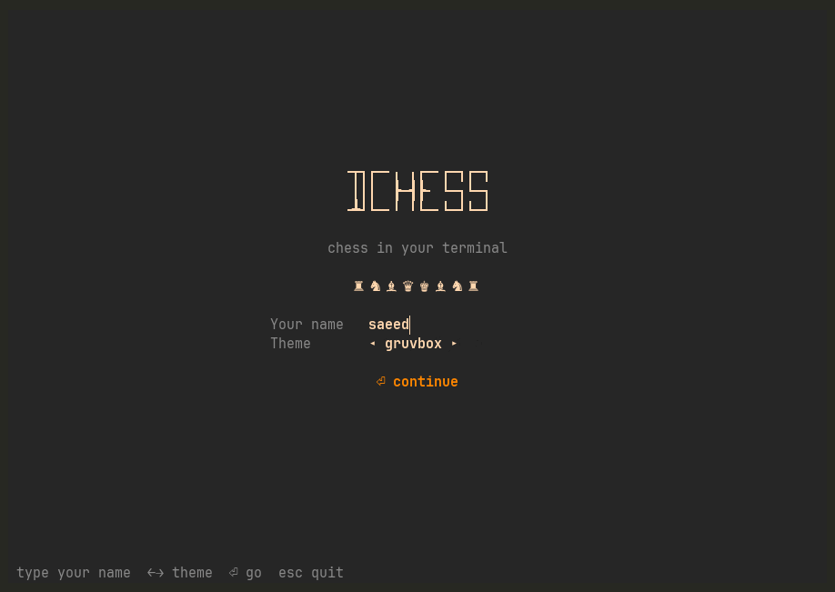
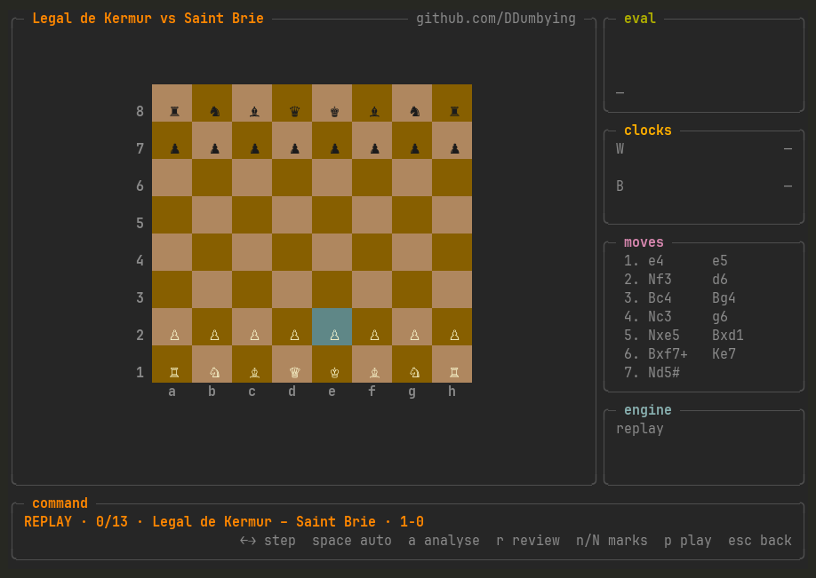
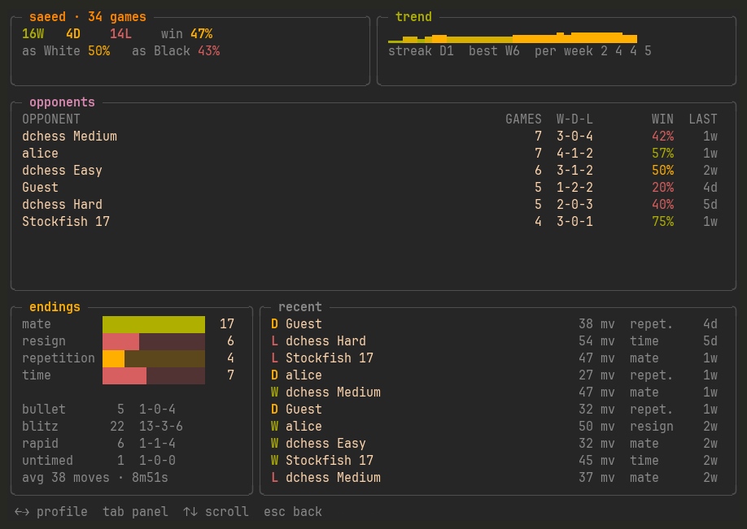

# Dchess - DumbChess


**A terminal chess engine written in C.**

One of these nerdy things built out of passion — to actually understand how `C` works and how chess works technically, under the hood.

**Links:** [GitHub](https://github.com/ddumbying/) · [User guide](docs/guide.md) · [Project journal](docs/overview.md) · ~[Documentation](https://ddumbying.vercel.app/projects/dchess/)~ (*WIP*) </br>

## Overview

<p align="center">
  
</p>

A 5+3 game against dchess with analysis on: the eval bar, the engine's best
move tinted on the board, the line it expects, the opening name, and the
clocks counting down.

## A quick tour

**First run and the launcher.** Name your profile, pick a theme (the screen
recolours as you go), and every later start opens the launcher: your
profiles, the new game (players, position, clock, book, hints, theme) beside
a mini-board, and your record.

<p align="center"></p>

**Replay and review.** Step through any saved game or PGN file, turn on
analysis, and let `r` review every move — `?!`, `?` and `??` mark what each
one cost, and `n`/`N` jump between them. `p` plays on from any position.

<p align="center"></p>

**Stats.** Every finished game a profile plays is kept, so the stats page can
show your record, trend, opponents, how games end, results by time control,
and the recent games — any of which opens as a replay.

<p align="center"></p>

## What it has

**Play**
- You, a friend or an engine on each side — including engine against engine,
  and changing who plays mid-game
- dchess at Easy, Medium or Hard, or any UCI engine you register (Stockfish,
  Leela, …) with its own strength and Elo limit
- Time controls: presets from 1+0 to 30+0, custom `M+S`, White/Black time
  odds, losing on time, engines that budget their own clock, a red clock
  under ten seconds, and a pause that freezes both clocks
- An opening book — built-in main lines or any Polyglot `.bin` — and the
  opening's ECO code and name as you play
- Any starting position by FEN, undo, and a board that flips for two players

**Analysis**
- `a` shows an eval bar, the score and depth, the best move (tinted on the
  board) and the line the engine expects, from dchess or a UCI engine
- A game review marks inaccuracies, mistakes and blunders in any replay

**Profiles, history and stats**
- A first-run welcome, then profiles that each keep their own history and
  remembered setup (players, clock, book, analysis engine, theme)
- Every finished game is saved to `~/.local/share/dchess/games.pgn`, a
  standard PGN file with tags for players, strength, time control, opening
  and how it ended
- A stats page: record, win rate as White and Black, trend, streaks, games
  per week, opponents, endings, results by time control, recent games
- Replay any saved game or any PGN file (`--replay`), and play on from any
  position in it

**Engine**
- Bitboard board representation, full legal move generation (castling,
  en passant, promotion), perft-verified
- Iterative-deepening principal-variation search with aspiration windows,
  null-move pruning, late-move reductions and check extensions, a
  transposition table, move ordering (TT move, captures, killers, history)
  and quiescence search — Hard reaches about depth 12–13 in its 5 seconds
- A tapered evaluation (material and piece-square tables, king safety that
  shifts toward the endgame)
- A principal line and correct mate distances for analysis
- Searches in a background thread, so the clocks and screen stay live, and
  `stop` takes its best move so far

**Interface**
- ncurses with Unicode pieces, scaled to the terminal
- Four colour themes (gruvbox, tokyonight, btop, catppuccin) with a live
  preview
- Vim-style input: move a cursor with `hjkl`/arrows and Enter, or press `i`
  and type moves and commands
- Legal moves, the last move and check highlighted on the board

## Getting started

```bash
make          # needs ncursesw and a C compiler
./dchess
```

`make test` runs the test suites. The first start greets you with a name and
theme; after that `dchess` opens the launcher. Pass any gameplay flag
(`--no-menu`, `--color`, `--white`, …) to skip it.

The [user guide](docs/guide.md) walks through everything in more depth:
engines, time controls, analysis and review, replays, profiles and the files
dchess keeps.

## CLI

```
USAGE
  dchess [OPTIONS]

OPTIONS
  -c, --color <white|black>       Choose your side (default: white)
  -d, --difficulty <easy|medium|hard>
        easy   – depth 2, up to 1.5s  (quick, forgiving)
        medium – depth 5, up to 3s   (balanced)  [default]
        hard   – as deep as it gets in 5s (challenging)
  -2, --two-player                Local two-player mode — no engine, board flips after each move
  --white <human|guest|profile|easy|medium|hard|engine>
  --black <human|guest|profile|easy|medium|hard|engine>
                                  Choose who plays a side; overrides -c, -d and -2
  --profile <name>                Play as this profile for this run
  --profiles                      List the profiles with their records and exit
  --book <builtin|off|path.bin>   Opening book for dchess's engine (default: built-in)
  --clock <M+S>                   Time control for this run, e.g. 5+3 or 5+0/1+0
  --engines                       List the registered UCI engines and exit
  --fen <string>                  Start from a custom FEN position instead of the standard setup
  --replay <file.pgn>             Step through the games in a PGN file
  -m, --menu                      Show the launcher to pick options visually,
                                   even if other flags were given
  --no-menu                       Skip the launcher and start immediately (classic instant-start)
  --theme <name>                  Color theme: gruvbox | tokyonight | btop | catppuccin
                                   (default: gruvbox)
  -s, --stats                     Show statistics in a full TUI screen and exit
  -V, --version                   Print version and exit
  -h, --help                      Show help and exit

EXAMPLES
  dchess                          Launcher (profiles, new game, your record)
  dchess --no-menu                Start immediately with defaults (white, medium)
  dchess -c black -d easy         Black side, easy difficulty, no menu
  dchess --no-menu --clock 5+3    A blitz game against dchess
  dchess --fen "<FEN string>"     Start from a custom position
  dchess --replay games.pgn       Pick a game from a PGN file and step through it
  dchess --two-player             Local two-player, board flips each turn
  dchess --white hard --black easy
                                  Watch the engine play itself
  dchess --white "Stockfish 1500" --black hard
                                  A registered UCI engine against dchess
  dchess --stats                  View your stats
```

## Controls

**Game screen — normal mode (default)**
```
h j k l / arrows   move the cursor
Enter              select a piece / confirm a move
Esc                deselect
i                  command mode (type moves and commands)
a                  analysis on / off
u                  take back a move
Space              pause / resume (freezes the clocks in a timed game)
Tab                stats popup (any key closes it)
```

**Command mode** (press `i`, `Esc` to leave)
```
e2e4               a move in coordinates
go                 one engine move for the side to move, even while paused
stop               a thinking engine plays its best move so far
new · undo         a new game · take back a move
flip · swap        turn the board · exchange the players
pause / resume     hold and restart the engines (Space does both)
white|black human [name|guest]
white|black engine [easy|medium|hard|name]
                   change who plays a side, mid-game
analyse <builtin|off|name>
                   choose the analysis engine
book <builtin|off|path>
                   change the opening book
engines            list the registered UCI engines
depth N            change dchess's search depth (1–8)
eval · fen         show the evaluation · the position as FEN
loadfen <FEN>      load a position
pgn [path]         save the game as PGN
theme <name>       gruvbox | tokyonight | btop | catppuccin
stats · help       the stats screen · the command list
resign · quit      resign for the human side · leave
```

**Launcher**
```
↑↓ / ←→            move between rows / change a value
Tab                profiles → new game → your card
n · r · d          new · rename · delete a profile
⏎                  start (or replay the game selected on your card)
e · s · Esc        engines screen · stats · quit
```

**Replay**
```
←→ · Home/End      step · jump to the start or end
Space              play the moves one a second
a · r · n/N        analysis · review every move · next/previous marked move
p                  play on from this position
Esc                back
```

## Where things live

| File | What |
|------|------|
| `~/.config/dchess/profiles.conf` | profiles and their remembered setup |
| `~/.config/dchess/engines.conf` | registered UCI engines |
| `~/.local/share/dchess/games.pgn` | every finished game, standard PGN |
| `~/.local/share/dchess/stats.dat` | pre-profile stats, imported on first run |

The two config files follow `XDG_CONFIG_HOME` when it is set.

## Scope

This engine isn't trying to be perfect — it's one of those things built because having a chess engine is **cool** and because it teaches you things.

So it's limited by design, and currently doesn't have:
- No networking
- No GUI (no plans either)
- ~~Could have its own design~~ — it does now
- F Windows
- IDK what else, we'll see
