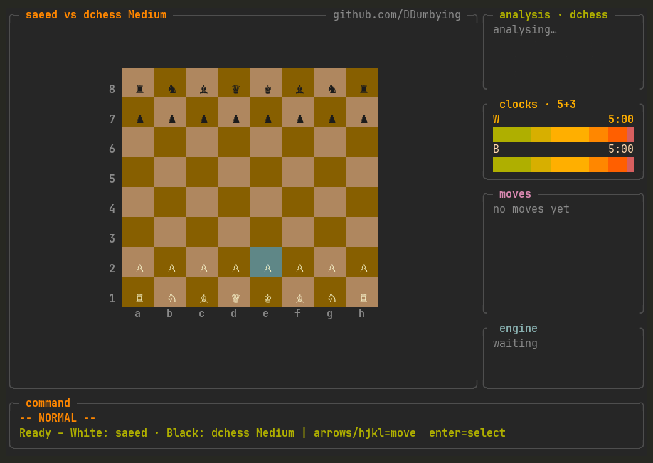

# Dchess - DumbChess


**A terminal chess engine written in C.**

One of these nerdy things built out of passion — to actually understand how `C` works and how chess works technically, under the hood.

**Links:** [GitHub](https://github.com/ddumbying/) · ~[Documentation](https://ddumbying.vercel.app/projects/dchess/)~ (*WIP*) </br>

## Overview

<p align="center">
  
</p>

## What it has

**Engine**
- Bitboard-based board representation
- Full move generation — pawns, castling, en passant, promotion
- Iterative deepening alpha-beta search (depth 1, 2, 3, ... up to the
  difficulty's cap or its time budget, whichever comes first) with a
  transposition table and move ordering (TT move, then captures/promotions)
- Quiescence search — keeps resolving captures/promotions/check-evasions
  past the nominal depth so the engine doesn't misjudge a position mid-trade
- Static evaluation with material values (centipawns) and piece-square tables
  for all piece types, with a phase-tapered king PST (encourages castling and
  king safety in the middlegame, centralization in the endgame)
- 50-move rule detection
- Threefold repetition detection via position hashing
- Stalemate and checkmate detection

**TUI**
- ncurses interface with Unicode chess pieces (♙♘♗♖♕♔ / ♟♞♝♜♛♚)
- Board scales to fill available terminal size
- Four built-in color themes (gruvbox/tokyonight/btop/catppuccin), switchable
  from the launcher (live preview), the CLI, or an in-game command
- First-run welcome to name your profile and pick a theme
- Launcher dashboard — profiles, the new-game setup with a live mini-board,
  and a card with your record, streak and recent games; CLI flags remain a
  scriptable alternative
- Profiles — each person keeps their own history and remembered settings;
  every finished game a profile plays is saved to `~/.local/share/dchess/games.pgn`
- Replay — step through any saved game or PGN file, and play on from any
  position in it
- Time controls — presets and custom clocks with increments and time odds,
  losing on time, engines that budget their own time, and a pause that
  freezes both clocks
- Analysis — an eval bar, the best move and the expected line from dchess
  or any UCI engine, while playing or replaying; a game review marks
  inaccuracies, mistakes and blunders
- FEN import/export — start from, view, or load any position, not just the
  standard setup
- The engine thinks in a background thread — the clock, redraws, and
  `quit` all keep working while it's calculating, even at "hard" difficulty
- Cancellable search — `stop` takes the engine's current best guess
  immediately; starting a new game or loading a position while it's
  thinking cancels the stale search automatically instead of waiting
- Vim-style modal input — normal mode for cursor navigation (`hjkl`/arrows), press `i` to enter command mode, `ESC` to return
- Legal move highlighting — blue squares for valid destinations
- Selected piece highlighted in green
- Check highlighted on the board — red square, gold king
- Last-move tint on from/to squares
- Move history, captured pieces, material advantage displayed in the side panel
- Live per-turn clock for both sides — starts counting on the first move, not at launch
- Evaluation bar updates live after every engine response
- Game-over popup appears immediately on checkmate/stalemate without needing a keypress
- Each side is you, a friend or the engine at any level — including engine against engine — configurable at launch or mid-game
- **Two-player local mode** — no engine, board flips 180° after each move so the next player faces their own pieces

**Statistics**
- Persistent stats saved to `~/.local/share/dchess/stats.dat`
- Win/loss/draw breakdown by difficulty (easy / medium / hard)
- Performance by color — games played and wins as white vs. black
- Overall record with a stacked W/L/D bar
- Avg moves per game, longest game, avg time per game, total play time
- Rolling win-rate history graph — plots win rate and loss rate over time using a sliding 10-game window, with date labels and a 50% guide line. Keeps the last 256 games.
- Two stat views:
  - **Tab** (in-game overlay) — small centered popup with W/L/D bar, win rate, per-difficulty breakdown and avg time; dismisses on any key
  - **Full stats screen** — all sections plus the history graph filling the remaining space; accessible via `dchess --stats` or `st` command in-game

## CLI

```
USAGE
  dchess [OPTIONS]

OPTIONS
  -c, --color <white|black>       Choose your side (default: white)
  -d, --difficulty <easy|medium|hard>
        easy   – depth 2, up to 1.5s  (quick, forgiving)
        medium – depth 5, up to 3s   (balanced)  [default]
        hard   – depth 8, up to 5s   (challenging, slower)
  -2, --two-player                Local two-player mode — no engine, board flips after each move
  --white <human|guest|profile|easy|medium|hard|engine>
  --black <human|guest|profile|easy|medium|hard|engine>
                                  Choose who plays a side; overrides -c, -d and -2
  --profile <name>                Play as this profile for this run
  --profiles                      List the profiles with their records and exit
  --book <builtin|off|path.bin>   Opening book for dchess's engine (default: built-in)
  --engines                       List the registered UCI engines and exit
  --fen <string>                  Start from a custom FEN position instead of the standard setup
  -m, --menu                      Show the launcher to pick options visually,
                                   even if other flags were given
  --no-menu                       Skip the launcher and start immediately (classic instant-start)
  --theme <name>                  Color theme: gruvbox | tokyonight | btop | catppuccin
                                   (default: gruvbox)
  -s, --stats                     Show statistics in a full TUI screen and exit
  --clock <M+S>                   Time control for this run, e.g. 5+3 or 5+0/1+0
  --replay <file.pgn>             Step through the games in a PGN file
  -V, --version                   Print version and exit
  -h, --help                      Show help and exit

EXAMPLES
  dchess                          Launcher (profiles, new game, your record)
  dchess --no-menu                Start immediately with defaults (white, medium)
  dchess --color black            Play as black, no menu
  dchess --difficulty hard        Hard mode, no menu
  dchess -c black -d easy         Black side, easy difficulty, no menu
  dchess --fen "<FEN string>"     Start from a custom position
  dchess --menu -d hard           Launcher, pre-filled to hard difficulty
  dchess --theme tokyonight       Start with the tokyonight color theme
  dchess --replay games.pgn       Pick a game from a PGN file and step through it
  dchess --two-player             Local two-player, board flips each turn
  dchess --white hard --black easy
                                  Watch the engine play itself
  dchess --white "Stockfish 1500" --black hard
                                  A registered UCI engine against dchess
  dchess --stats                  View your stats
```

The first time, `dchess` greets you: type your name, pick a theme with ←→,
and press Enter. After that, running `dchess` with no arguments shows the
launcher: your profiles (Tab to focus; `n` new, `r` rename, `d` delete, ↑↓
switch), the new game setup (players, position, opening book, theme) beside
a mini-board of the starting position, and your profile's record and recent
games, so you don't need to remember flags. Pressing `s`
shows the active profile's stats; `ESC`
quits dchess entirely rather than starting a game. Passing any gameplay
flag (`--color`, `--difficulty`, `--two-player`, `--fen`, `--theme`) skips
it and starts immediately, so scripts and muscle-memory invocations keep
working exactly as before.

To replay a game, press ⏎ on it in the launcher's profile card (Tab to
reach it) or in the stats page's recent list, or run `dchess --replay FILE`.
←→ step through the moves, Home/End jump to either end, space plays them
one a second, `p` plays on from the position shown with your usual setup,
and Esc goes back.

Games are untimed unless you pick a time control: the launcher's Clock row
cycles 1+0, 3+0, 3+2, 5+0, 5+3, 10+0, 10+5, 15+10 and 30+0, or `custom…`
takes minutes+seconds of increment (`7+2`, `0.5+0`) and White/Black odds
(`5+0/1+0`). It is remembered per profile; `--clock` sets one for a single
run. A side whose clock reaches zero loses on time (a draw if the other
side cannot mate). Engines split their remaining time themselves, UCI
engines get the real clocks, and under ten seconds a clock turns red. Space
pauses and freezes both clocks in a timed game, even between two people.
Saved games carry the standard `TimeControl` tag, and the stats page shows
results by bullet, blitz, rapid and classical.

Press `a` in a game or a replay to show analysis: an eval bar, the score
and depth, the best move (its squares tinted on the board) and the line the
engine expects. The launcher's Hints row, or the `analyse
<builtin|off|name>` command, picks the engine and remembers it. The
built-in engine analyses only while it is not also thinking about its own
move. In a replay, `r` reviews every move: `?!`, `?` and `??` mark the
moves that lost 0.5, 1 and 3 pawns, and `n`/`N` jump between them.

Pressing `e` opens the Engines screen, where you add a UCI engine by its path
(dchess starts it and reads its name), set its strength (time per move or
depth, plus an Elo cap when the engine supports one), test it, or delete it.
Registered engines then appear in the White and Black choices.

## Build

```bash
make
./dchess
```

Requires `ncursesw`.

## Controls

**Cursor — normal mode (default)**
```
h / ←       move cursor left
l / →       move cursor right
k / ↑       move cursor up
j / ↓       move cursor down
Enter       select piece / confirm move
Esc         deselect
i           enter command/insert mode
Tab         open in-game stats popup (any key to close)
Space       pause / resume the engines
```

**Command mode** (press `i` to enter, `ESC` to exit)
```
e2e4        make a move in algebraic notation
go          play one engine move for the side to move, even while paused
stop        have a thinking engine return its best move now, instead
            of waiting out the rest of its time budget
new         reset the board
flip        turn the board around
pause / resume
            hold and restart the engines (Space does both)
white|black human
white|black engine [easy|medium|hard|name]
            change who plays a side, mid-game
swap        exchange the two players
engines     list the registered UCI engines
book <builtin|off|path>
            change the opening book
depth N     change search depth (1–8) mid-game
eval        show current position evaluation
fen         show the current position as a FEN string
loadfen <FEN>
            load a custom position mid-game
theme <name>
            switch color theme: gruvbox | tokyonight | btop | catppuccin
stats       open the full stats screen
help        list in-game commands
quit / q    exit
```

## Scope

This engine isn't trying to be perfect — it's one of those things built because having a chess engine is **cool** and because it teaches you things.

So it's limited by design, and currently doesn't have:
- No networking
- No GUI (no plans either)
- ~~Could have its own design~~ — it does now
- F Windows
- IDK what else, we'll see
